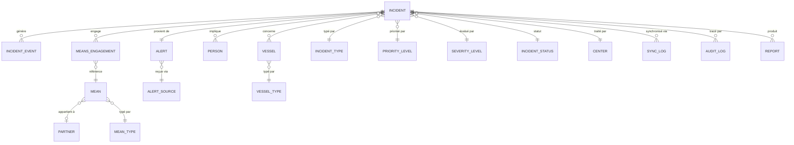

# SGIM — Système de Gestion des Incidents Maritimes

**MRCC Abidjan · Centre secondaire MRSC San Pedro**


> Plateforme numérique de coordination des opérations de recherche et de sauvetage maritime (SAR) pour la Côte d'Ivoire, couvrant le Centre de Coordination de Sauvetage Maritime (MRCC) d'Abidjan et son centre secondaire (MRSC) de San Pedro.

**Objectif opérationnel** : remplacer les procédures papier et les fichiers Excel dispersés par un outil unique, traçable et disponible 24/7, permettant de qualifier une alerte, d'engager les moyens adaptés, de suivre une opération SAR en temps réel et d'en conserver l'historique complet à des fins d'audit et de statistiques.

---

## Sommaire

1. [Équipe de développement](#1-équipe-de-développement)
2. [Vision et finalité du SGIM](#2-vision-et-finalité-du-sgim)
3. [Architecture des dossiers](#3-architecture-des-dossiers)
4. [Modélisation de la base de données](#4-modélisation-de-la-base-de-données)
5. [Cahier des charges fonctionnel](#5-cahier-des-charges-fonctionnel)
6. [Workflow opérationnel](#6-workflow-opérationnel)
7. [Sécurité, disponibilité et continuité](#7-sécurité-disponibilité-et-continuité)
8. [Intégrations futures envisagées](#8-intégrations-futures-envisagées)
9. [Démarrage du projet (environnement de développement)](#9-démarrage-du-projet-environnement-de-développement)
10. [Conventions de code et bonnes pratiques](#10-conventions-de-code-et-bonnes-pratiques)
11. [Roadmap et points critiques](#11-roadmap-et-points-critiques)

---

## 1. Équipe de développement

| Rôle | Nom | Responsabilités principales |
|---|---|---|
| Développeur Fullstack | **Jean Chrysostome** | Architecture générale, backend Django, synchronisation MRCC/MRSC, intégrations (Firebase, Google Maps), mise en production |
| Développeur Junior Fullstack | **Kinhon Gabriel** | Développement des interfaces Next.js, composants métier, contribution aux modules fonctionnels, tests |

Le projet est conduit en binôme, avec des revues de code croisées avant toute fusion sur la branche principale. Les décisions d'architecture structurantes (modèle de données, schéma de synchronisation, gestion des rôles) sont documentées dans ce dépôt avant implémentation.

---

## 2. Vision et finalité du SGIM

Le sauvetage en mer se joue sur des minutes. Entre le moment où une alerte est reçue (VHF, téléphone, balise, tiers) et celui où les premiers moyens sont engagés, chaque étape — qualification, évaluation de la gravité, identification des moyens disponibles, notification des partenaires — doit être rapide, fiable et traçable.

Aujourd'hui, une partie de ce travail repose sur des supports non centralisés : fichiers Excel pour les référentiels (types d'alerte, moyens, partenaires), échanges téléphoniques non journalisés entre Abidjan et San Pedro, comptes rendus rédigés a posteriori. Cela crée trois risques : perte d'information, incohérence entre les deux centres, et difficulté à reconstituer un dossier d'incident pour un rapport ou un retour d'expérience.

Le SGIM répond à ce besoin en offrant :

- **Un point d'entrée unique** pour toute alerte maritime, quelle que soit sa source ;
- **Une vision partagée en temps réel** entre le MRCC Abidjan et le MRSC San Pedro sur les incidents en cours et les moyens disponibles ;
- **Une traçabilité intégrale** de chaque décision et de chaque action, du premier appel jusqu'à la clôture du dossier ;
- **Un socle de données de référence unique** (types d'alerte, priorités, moyens, partenaires, navires) qui élimine les incohérences de saisie actuelles ;
- **Une disponibilité continue**, y compris en cas de coupure réseau, grâce à un fonctionnement partiellement hors-ligne sur les postes fixes et embarqués.

Le SGIM n'est pas un outil de plus à côté des procédures existantes : il devient le registre de référence de l'activité SAR ivoirienne, consultable, exportable et auditable.

---

## 3. Architecture des dossiers

Le projet est un **monorepo** organisé autour d'une séparation stricte entre le domaine métier, l'infrastructure technique et les interfaces (web, desktop, mobile). Cette organisation permet de faire évoluer une plateforme (par exemple ajouter le support LRIT) sans toucher au cœur métier, et de garantir qu'une règle SAR (ex. priorité d'un MAYDAY) est écrite **une seule fois** et appliquée partout.

Pour un système critique fonctionnant 24/7, cette rigueur n'est pas un confort de développeur : c'est ce qui garantit que le comportement du système reste prévisible en production, que les bugs sont isolés rapidement, et que deux développeurs (aujourd'hui) puis une équipe plus large (demain) peuvent travailler sans se marcher dessus.

### 3.1 Frontend — Next.js (App Router)

```
sgim-web/
├── app/                          # Routing App Router (segments = fonctionnalités)
│   ├── (auth)/                   # Connexion, récupération de compte
│   ├── (dashboard)/
│   │   ├── incidents/            # Liste, détail, création d'incident
│   │   ├── alertes/nouvelle/     # Formulaire "Nouvelle Alerte" (point d'entrée)
│   │   ├── operations-sar/       # Suivi des opérations en cours
│   │   ├── navires/
│   │   ├── personnes/            # Victimes, rescapés, équipages
│   │   ├── moyens/                # Moyens maritimes, aériens, partenaires
│   │   ├── partenaires/
│   │   ├── carte/                 # Carte SIG interactive
│   │   ├── communications/
│   │   ├── journal/                # Journal des événements (audit)
│   │   ├── rapports/
│   │   ├── administration/        # Utilisateurs, rôles, référentiels
│   │   └── synchronisation/       # État de sync MRCC ↔ MRSC
│   ├── api/                       # Route handlers ponctuels (webhooks, callbacks)
│   └── layout.tsx
├── core/                          # Domaine métier, indépendant du framework
│   ├── entities/                  # Incident, Navire, Personne, Moyen, Alerte...
│   ├── value-objects/             # Position GPS, Gravité, Statut, Priorité
│   └── interfaces/                # Contrats (ports) implémentés par lib/services
├── services/                      # Logique métier applicative
│   ├── sar-workflow/               # Machine à états du cycle de vie d'un incident
│   ├── sync/                       # Réconciliation des données MRCC/MRSC
│   ├── alerting/                   # Notifications, escalades
│   └── reporting/  
├── context/
├── lib/                # Génération de rapports et statistiques
├── hooks/                          # Hooks React réutilisables (use-incident, use-carte...)

│   ├── api-client/                  # Client HTTP typé vers l'API Django
│   ├── firebase/                    # Init Firebase, écoute Firestore, presence
│   ├── maps/                          # Wrappers Google Maps, couches SIG/AIS
│   └── offline/                       # File d'attente locale, synchronisation différée
├── components/
│   ├── ui/                            # Composants shadcn/ui génériques
│   └── features/
cards
sections
form                      # Composants liés à un module (IncidentCard, MoyenSelect...)
└── types/                              # Types TypeScript partagés
```

**Pourquoi cette organisation** : `core/` ne dépend de rien — ni de Next.js, ni de Firebase, ni de Google Maps. Cela permet de tester la logique métier (par exemple : "un MAYDAY doit toujours passer en priorité maximale") indépendamment de l'interface. Si demain le SGIM change de fournisseur cartographique, seul `lib/maps/` est concerné.

### 3.2 Backend — Django (DRF)

```
sgim-api/
├── config/                         # Settings, urls, wsgi/asgi
├── apps/
│   ├── incidents/                   # Cœur : incidents, qualification, cycle de vie
│   ├── alerts/                       # Réception et création des alertes
│   ├── means/                        # Moyens de secours (navires, aéronefs, partenaires)
│   ├── vessels/                        # Registre des navires
│   ├── people/                          # Personnes impliquées (victimes, équipages)
│   ├── partners/                        # Organismes partenaires (Marine, armateurs, ONG...)
│   ├── maps/                             # Zones SAR, couches SIG, positions
│   ├── communications/                    # Notifications, journal des échanges
│   ├── reports/                            # Génération de rapports, exports
│   ├── reference_data/                     # Référentiels centralisés (voir §4.3)
│   ├── sync/                                # Synchronisation MRCC Abidjan ↔ MRSC San Pedro
│   ├── audit/                                # Journalisation (qui, quoi, quand)
│   └── users/                                 # Comptes, rôles, permissions
├── core/                                       # Règles métier transverses, exceptions domaine
└── tests/
```

Chaque app Django est **autonome** (modèles, sérialiseurs, vues, tests propres) mais s'appuie sur `reference_data` pour toute liste de valeurs — aucune app ne définit sa propre liste de types ou de statuts en dur.

### 3.3 Desktop — Electron.js

```
sgim-desktop/
├── main/                # Process principal (fenêtres, menu, mises à jour)
├── preload/              # Ponts sécurisés entre main et renderer
├── renderer/               # Réutilise l'app Next.js (export statique ou embarquée)
└── native/                  # Accès SQLite local, impression, notifications système
```

Le desktop encapsule l'interface web pour les postes d'opérateur au sein du MRCC/MRSC, avec un accès direct à une base **SQLite locale** utilisée comme cache de continuité en cas de coupure réseau.

### 3.4 Mobile — Capacitor

```
sgim-mobile/
├── ios/
├── android/
└── src/                  # Couche web partagée avec sgim-web (composants adaptés mobile)
```

Usage mobile : consultation terrain (agents en mission, moyens déployés), remontée de position et de compte rendu simplifié, notifications push d'alerte.

---

## 4. Modélisation de la base de données

### 4.1 Principes

- Toute liste de valeurs affichée dans un menu déroulant provient d'une **table de référence en base**, jamais d'une valeur codée en dur dans le frontend.
- Chaque table métier porte des champs d'audit (`created_at`, `created_by`, `updated_at`, `updated_by`) en complément du journal d'audit dédié.
- Les identifiants sont des UUID pour permettre la synchronisation entre les deux centres sans collision.

### 4.2 Schéma des entités principales



### 4.3 Tables de référence centralisées (référentiels)

Ces tables remplacent l'ensemble des listes actuellement maintenues dans des fichiers Excel. Chaque référentiel est administrable via le module **Administration**, avec historique de modification.

| Table | Rôle métier |
|---|---|
| `incident_type` | Types d'incident : MAYDAY, PAN PAN, homme à la mer, incendie, naufrage, collision, échouement, piraterie, pollution, MEDEVAC... |
| `priority_level` | Niveaux de priorité opérationnelle |
| `severity_level` | Niveaux de gravité |
| `incident_status` | Statuts du cycle de vie (ouvert, en cours, engagé, clôturé, archivé...) |
| `alert_source` | Origine de l'alerte (VHF, téléphone, balise COSPAS-SARSAT, tiers, GMDSS...) |
| `vessel_type` | Types de navires (pêche, commerce, plaisance, transport de passagers...) |
| `mean_type` | Types de moyens (vedette SAR, hélicoptère, navire partenaire, plongeurs...) |
| `partner_category` | Catégories de partenaires (Marine nationale, armateurs, ONG, douanes...) |
| `role` | Rôles utilisateurs (opérateur, chef d'opération, administrateur, consultation) |
| `center` | Centres (MRCC Abidjan, MRSC San Pedro) |

### 4.4 Tables métier principales

| Table | Champs principaux | Relations |
|---|---|---|
| `alert` | id, source_id, reçue_le, appelant, position_initiale, description_brute | 1-1 avec `incident` (une alerte qualifiée devient un incident) |
| `incident` | id, type_id, priorité_id, gravité_id, statut_id, centre_id, position, ouvert_le, clôturé_le | Cœur du modèle, relié à quasi toutes les autres tables |
| `incident_event` | id, incident_id, horodatage, auteur_id, description, type_événement | N-1 avec `incident` (historique chronologique) |
| `vessel` | id, nom, type_id, pavillon, immatriculation, caractéristiques | N-N avec `incident` via `incident_vessel` |
| `person` | id, nom, rôle_dans_incident (victime, rescapé, équipage), état | N-N avec `incident` via `incident_person` |
| `mean` | id, nom, type_id, partenaire_id, statut_disponibilité, position_actuelle | N-N avec `incident` via `means_engagement` |
| `means_engagement` | id, incident_id, mean_id, engagé_le, dégagé_le, résultat | Trace l'usage réel d'un moyen sur un incident donné |
| `partner` | id, nom, catégorie_id, contact, zone_de_couverture | 1-N avec `mean` |
| `communication_log` | id, incident_id, canal, expéditeur, destinataire, horodatage, contenu | N-1 avec `incident` |
| `report` | id, incident_id, généré_le, généré_par, type_rapport, fichier | N-1 avec `incident` |
| `sync_log` | id, entité, entité_id, centre_source, centre_cible, statut_sync, horodatage | Trace chaque échange MRCC ↔ MRSC |
| `audit_log` | id, utilisateur_id, action, table_cible, enregistrement_id, avant, après, horodatage | Journal d'audit transverse à tout le système |
| `user_account` | id, nom, centre_id, rôle_id, actif | 1-N avec `incident` (création, affectation), `audit_log` |

### 4.5 Synchronisation MRCC Abidjan ↔ MRSC San Pedro

La synchronisation repose sur un modèle **centre propriétaire** : chaque enregistrement appartient à un centre (`center_id`), qui en est responsable. Les mises à jour sont propagées à l'autre centre via `sync_log`, avec horodatage et statut (`en attente`, `synchronisé`, `en conflit`). En cas de coupure réseau, les modifications sont mises en file locale (SQLite côté desktop) et rejouées à la reconnexion. Un incident peut être transféré d'un centre à l'autre (changement de `center_id`), ce transfert étant lui-même un événement journalisé dans `incident_event`.

---

## 5. Cahier des charges fonctionnel

*Cette section décrit le système du point de vue de l'opérateur MRCC/MRSC, sans vocabulaire technique.*

### 5.1 Tableau de bord opérationnel

Écran d'accueil de tout utilisateur connecté. Il présente en un coup d'œil : les incidents en cours classés par priorité, les moyens actuellement engagés, les alertes non encore qualifiées, et un indicateur d'état de synchronisation avec l'autre centre. Un chef d'opération doit pouvoir, en moins de dix secondes, savoir ce qui se passe actuellement dans les deux centres.

### 5.2 Nouvelle Alerte — point d'entrée principal

C'est l'écran le plus utilisé et le plus critique du système : chaque incident commence par une alerte saisie ici. Le formulaire capture la source de l'alerte, l'heure de réception, la position, l'identité de l'appelant si connue, et une première description libre de la situation.

**Point d'attention majeur** : ce module repose entièrement sur des listes déroulantes (type d'alerte, source, priorité provisoire...). Ces listes doivent provenir des référentiels centralisés en base (voir §4.3) et non de fichiers Excel externes copiés à la main, ce qui est la source principale d'incohérences aujourd'hui constatées (valeurs orthographiées différemment, listes désynchronisées entre postes, valeurs manquantes après mise à jour). Le SGIM doit garantir qu'une même liste, vue à Abidjan ou à San Pedro, contient strictement les mêmes valeurs au même moment.

Une fois l'alerte enregistrée, l'opérateur peut la qualifier directement en incident ou la conserver en attente si l'information est encore insuffisante.

### 5.3 Gestion des incidents

Module central qui couvre l'ensemble des types de situations : MAYDAY, PAN PAN, homme à la mer, incendie à bord, naufrage, collision, échouement, acte de piraterie, pollution marine, évacuation médicale (MEDEVAC), et autres catégories définies dans le référentiel. Pour chaque incident, l'opérateur dispose d'une fiche unique regroupant la qualification initiale, la position, les navires et personnes concernés, les moyens engagés, l'historique chronologique des actions et le statut courant. C'est le dossier de référence consultable par toute personne habilitée, à Abidjan comme à San Pedro.

### 5.4 Opérations SAR (workflow complet)

Ce module accompagne le déroulement concret d'une opération de sauvetage : de l'engagement des premiers moyens jusqu'au compte rendu final. Il permet de suivre en temps réel quels moyens sont en route, sur zone, ou dégagés, et de consigner les décisions prises par le chef d'opération à chaque étape (voir le cycle complet en §6).

### 5.5 Gestion des navires

Registre des navires impliqués dans un incident (navire en détresse, navire assistant, navire suspect en cas de piraterie...). Chaque fiche navire conserve les caractéristiques utiles à l'opération : type, pavillon, immatriculation, et historique des incidents dans lesquels il a été impliqué.

### 5.6 Personnes et victimes

Suivi nominatif des personnes concernées par un incident : victimes, rescapés, membres d'équipage. Chaque personne est rattachée à un ou plusieurs incidents avec son état (sain et sauf, blessé, disparu, décédé) mis à jour au fil de l'opération. Ce module alimente directement les statistiques réglementaires.

### 5.7 Gestion des moyens de secours

Recense l'ensemble des moyens mobilisables : vedettes SAR, hélicoptères, navires de partenaires, équipes à terre. Pour chaque moyen, l'opérateur voit sa disponibilité, sa position, et son historique d'engagement. C'est ce module qui permet, au moment de qualifier un incident, de savoir immédiatement quels moyens sont mobilisables à proximité.

### 5.8 Gestion des partenaires

Organismes extérieurs pouvant fournir des moyens ou une expertise (Marine nationale, armateurs, ONG, douanes, autorités portuaires...). Le module conserve leurs coordonnées de contact, leur zone de couverture et les moyens qu'ils mettent à disposition.

### 5.9 Carte SIG

Visualisation cartographique des incidents en cours, des zones SAR, des moyens déployés et, à terme, des positions AIS des navires. L'opérateur peut cliquer sur un élément de la carte pour accéder directement à sa fiche détaillée. La carte est l'outil de coordination visuelle entre les deux centres.

### 5.10 Communications et notifications

Journalise les échanges liés à un incident (appels, messages, notifications envoyées aux partenaires ou entre centres) et permet d'envoyer des notifications ciblées (par exemple : alerter un partenaire qu'un de ses moyens est sollicité).

### 5.11 Journal des événements

Historique chronologique et non modifiable de toutes les actions effectuées sur un incident : qui a fait quoi, et à quel moment. C'est la mémoire factuelle de l'opération, indispensable en cas de retour d'expérience ou d'enquête.

### 5.12 Rapports et statistiques

Génération de rapports d'incident (individuels) et de statistiques agrégées (nombre d'interventions par type, temps moyen de réponse, taux de réussite des opérations...) destinés aux autorités de tutelle et aux besoins internes de pilotage.

### 5.13 Administration et utilisateurs

Gestion des comptes utilisateurs, de leurs rôles (opérateur, chef d'opération, administrateur, consultation) et des référentiels centralisés (types, statuts, listes déroulantes). C'est ici que la gouvernance des listes déroulantes évoquée en §5.2 est administrée, avec un historique des modifications.

### 5.14 Synchronisation MRCC Abidjan / MRSC San Pedro

Écran de suivi de l'état de synchronisation entre les deux centres : incidents en attente de propagation, éventuels conflits à arbitrer, dernier échange réussi. Il permet à un chef d'opération de vérifier, en cas de doute, que les deux centres partagent bien la même vision d'un incident en cours.

---

## 6. Workflow opérationnel

Cycle de vie complet d'un incident, de la réception de l'alerte à son exploitation statistique :

```
Alerte reçue
   │
   ▼
Qualification (rattachement à un type d'incident)
   │
   ▼
Évaluation (gravité, priorité, position, moyens nécessaires)
   │
   ▼
Validation (par le chef d'opération)
   │
   ▼
Notification (partenaires concernés, centre secondaire si besoin)
   │
   ▼
Engagement des moyens (affectation, suivi de trajet, arrivée sur zone)
   │
   ▼
Suivi SAR (mise à jour continue de l'état de l'opération)
   │
   ▼
Compte rendu (résultat de l'opération, personnes/navires impliqués)
   │
   ▼
Clôture (statut final de l'incident)
   │
   ▼
Archivage (conservation intégrale du dossier)
   │
   ▼
Statistiques (alimentation des rapports et indicateurs)
```

Chaque flèche de ce cycle correspond à un événement journalisé dans `incident_event`, ce qui permet de reconstituer intégralement le déroulé d'un incident a posteriori.

---

## 7. Sécurité, disponibilité et continuité

- **Disponibilité 24/7** : le système est le support d'une activité qui ne s'arrête jamais ; toute maintenance planifiée doit prévoir une continuité de service (bascule sur le centre secondaire ou mode dégradé local).
- **Rôles et permissions** : accès strictement défini par rôle (opérateur, chef d'opération, administrateur, consultation), avec principe du moindre privilège.
- **Chiffrement** : toutes les communications transitent en HTTPS ; les données sensibles (positions, identités des victimes) sont protégées au repos comme en transit.
- **Journalisation exhaustive** : toute action de création, modification ou suppression est tracée dans `audit_log`, sans exception.
- **Sauvegardes** : sauvegardes régulières de la base de production, avec procédure de restauration testée.
- **Plan de continuité** : bascule vers le centre secondaire en cas d'indisponibilité prolongée d'un site.
- **Mode hors-ligne partiel** : les postes desktop (Electron) et l'application mobile (Capacitor) disposent d'un cache local SQLite permettant de continuer à consulter et saisir des données en cas de coupure réseau, avec synchronisation différée à la reconnexion.

---

## 8. Intégrations futures envisagées

Les intégrations suivantes sont **prévues** dans l'architecture mais dépendent d'accès et d'accords encore à obtenir auprès des organismes concernés :

- **AIS** (Automatic Identification System) — positions de navires en temps réel
- **LRIT** (Long-Range Identification and Tracking)
- **VMS** (Vessel Monitoring System)
- **GMDSS** (Global Maritime Distress and Safety System)
- **COSPAS-SARSAT** — réception directe des balises de détresse
- **MarineTraffic** ou équivalent — enrichissement des données navires
- **Données météo maritimes** — conditions de mer pour l'évaluation du risque

L'architecture (`lib/maps/`, `apps/maps/`) est conçue pour accueillir ces flux sous forme de nouvelles sources de données sans remise en cause du modèle central.

---

## 9. Démarrage du projet (environnement de développement)

### 9.1 Prérequis

- Node.js 20+ et pnpm
- Python 3.11+ et pip
- MySQL 8+ (ou SQLite pour un démarrage rapide en local)
- Compte Firebase (projet de développement dédié)
- Clé API Google Maps (avec facturation activée en mode restreint pour le développement)


### 9.3 Installation du backend

```bash
cd sgim-api
python -m venv venv && source venv/bin/activate
pip install -r requirements.txt
cp .env.example .env
python manage.py migrate
python manage.py runserver
```

### 9.4 Configuration Firebase

1. Créer un projet Firebase dédié à l'environnement de développement.
2. Activer Firebase Auth (méthode email/mot de passe) et Firestore.
3. Renseigner les clés dans `sgim-web/.env.local` (`NEXT_PUBLIC_FIREBASE_*`).
4. Déployer des règles Firestore restrictives dès le départ (pas de lecture publique).

### 9.5 Configuration Google Maps

1. Activer les API Maps JavaScript et Places dans la console Google Cloud.
2. Restreindre la clé API par domaine (développement/production séparés).
3. Renseigner `NEXT_PUBLIC_GOOGLE_MAPS_API_KEY` dans `.env.local`.

### 9.6 Lancement Electron

```bash
cd sgim-desktop
pnpm install
pnpm electron:dev
```

### 9.7 Build Capacitor

```bash
cd sgim-mobile
pnpm install
npx cap sync
npx cap open ios      # ou: npx cap open android
```

### 9.8 Migration et alimentation des référentiels

```bash
cd sgim-api
python manage.py migrate reference_data
python manage.py seed_reference_data --source=data/referentiels/
```

Le script `seed_reference_data` importe les référentiels depuis des fichiers sources contrôlés (et non plus depuis des copies Excel non versionnées), avec validation de cohérence avant insertion.

---

## 10. Conventions de code et bonnes pratiques

- **TypeScript strict** activé sur l'ensemble du frontend ; aucun `any` implicite toléré.
- **Validation systématique des entrées** (Zod côté Next.js, serializers/FormRequest équivalents côté Django) avant toute écriture en base.
- **Gestion d'erreurs explicite** : chaque appel réseau distingue erreur réseau, erreur de validation et erreur serveur, avec message adapté à l'opérateur (pas de message technique brut à l'écran).
- **Offline-first partiel** : toute action critique (création d'alerte, mise à jour de statut) est mise en file locale avant confirmation serveur, pour ne jamais bloquer un opérateur en cas de réseau instable.
- **Tests** : couverture prioritaire sur `core/` (règles métier) et sur le module `sar-workflow`, qui concentre la logique la plus sensible.
- **Revue de code obligatoire** avant fusion sur la branche principale, avec vérification explicite de tout changement touchant aux référentiels ou à la synchronisation.
- **Aucune valeur métier codée en dur** dans le frontend (types, statuts, priorités) : tout passe par les référentiels de `reference_data`.

---

## 11. Roadmap et points critiques

### Priorité immédiate

- **Fiabilisation du module Nouvelle Alerte** : migrer l'ensemble des listes déroulantes depuis les fichiers Excel actuels vers les tables de référence centralisées, avec un script de migration contrôlé suivant la chaîne : `Excel source → validation → import en base → table de référence → alimentation du composant Select → enregistrement de l'alerte → restitution cohérente sur les deux centres`. Cette migration doit être vérifiée poste par poste avant bascule définitive.
- Mise en place du mécanisme de synchronisation MRCC/MRSC (`sync_log`) et de son écran de suivi.
- Finalisation du workflow SAR complet (§6) avec journalisation systématique de chaque transition.

### Court terme

- Module Rapports et statistiques : premiers exports réglementaires.
- Mode hors-ligne desktop (Electron + SQLite) pour les postes MRCC/MRSC.
- Gestion fine des rôles et permissions par module.

### Moyen terme

- Application mobile Capacitor (consultation terrain, notifications push).
- Premiers travaux d'intégration AIS, sous réserve d'accès obtenu.

### Points de vigilance identifiés

- La cohérence des référentiels entre les deux centres est le risque le plus élevé du projet à court terme : tant que la migration des listes déroulantes n'est pas achevée et vérifiée, aucune donnée de production ne doit être considérée comme fiable pour les statistiques.
- La synchronisation en cas de coupure réseau prolongée nécessite des tests de charge et de reprise avant mise en production.

---

*Document de référence technique et métier du projet SGIM. Toute évolution structurante (modèle de données, workflow SAR, règles de synchronisation) doit être répercutée dans ce README avant implémentation.*# sgim

